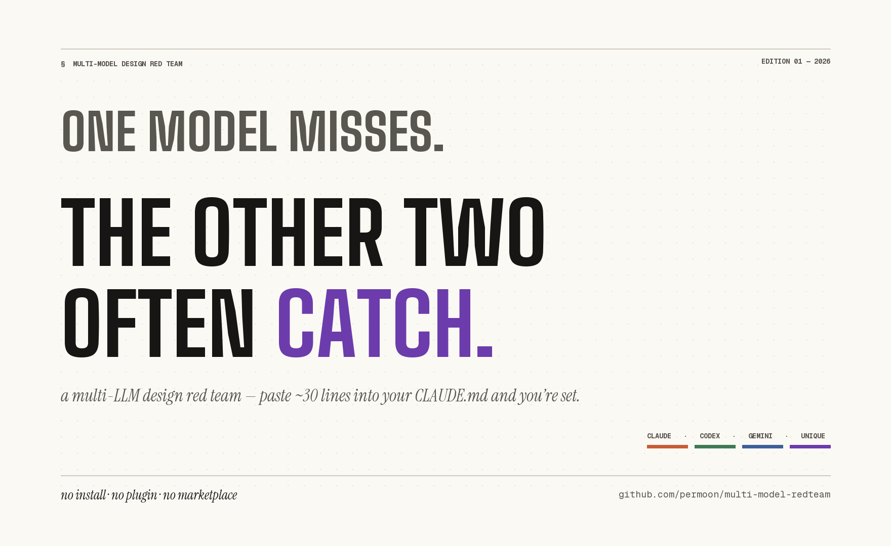

# multi-model-redteam

> 三家 LLM 平行對你的設計做 review。一家沒看到的，另外兩家通常會接住。
>
> **不用裝 plugin、不用上 marketplace、不用 npm 或 pip — 什麼都不用裝。** 把 30 行貼進你的 `CLAUDE.md`，下次叫 Claude Code review 計畫的時候，它會自己分頭叫 Codex CLI 跟 Gemini CLI 平行跑，再把三家的 finding 整合回來。

> **這不是 jailbreak 紅隊**。這年頭大家都用 AI 寫執行計畫，而執行計畫的好壞會從源頭影響 AI 最後的產出，所以在計畫階段就帶入更強大、更完整的設計紅隊就更顯重要。

> 如果你找的是 prompt injection 或 safety alignment，請看
> [garak](https://github.com/leondz/garak) 或
> [promptfoo](https://github.com/promptfoo/promptfoo)。

[English README](./README.md) · [方法論](./docs/methodology.zh-TW.md) · [章節索引](#章節索引)



## 三種跑法，都不用安裝這個 repo

挑一種適合你的就好，每一種都自帶完整流程。

### Tier 0 — 把 30 行貼進你的 `CLAUDE.md`（最低門檻）

如果你已經在用 Claude Code、而且 Codex CLI 跟 Gemini CLI 已經在你的 `PATH` 上（chapter 0 會帶你裝），這就是門檻最低的玩法：

1. 打開你專案的 `CLAUDE.md`（Claude Code 每次 session 都會讀的那個檔案）
2. 把 [`claude-md-snippet.md`](./claude-md-snippet.md) 裡的 snippet 區塊貼到最後面
3. 沒了。**不用裝 plugin、不用上 marketplace、不用 npm、不用 pip、什麼都不用裝。連這個 repo 都不用 clone。**

下次你在這個專案叫 Claude Code review 計畫的時候，它就會自己分頭叫 Codex CLI 跟 Gemini CLI 平行跑，再把三家的 finding 整合成一份報告丟回來。

### Tier 1 — 跑 bash 腳本

想在 Claude Code 之外對某個 `plan.md` 直接跑紅隊？5 行裝起來：

```bash
git clone https://github.com/permoon/multi-model-redteam.git
cd multi-model-redteam
export ANTHROPIC_API_KEY=... OPENAI_API_KEY=... GEMINI_API_KEY=...
bash 06-going-further/final/redteam.sh examples/sample-plan.md
# → ./redteam-out-<timestamp>/ranked.md
```

費用：sample plan 約 $0.10–0.20；production-size plan 約 $0.50–2.00（鎂刀）。
單次 wall time 約 5–15 分鐘（consolidate + rank 那兩步 Claude call 是 bottleneck）。

### Tier 2 — 把 prompt 貼到 chat UI

連 CLI 都沒裝？把下面的 prompt 貼到 Claude、ChatGPT、或 Gemini 的 chat UI。這樣只會拿到一家的 review，但比沒有 frame 隨便看看還是好太多。

<details>
<summary>📋 5 個檢核維度的紅隊 prompt</summary>

```
You are the red team for this design.

Cover all 5 dimensions below. For each, provide AT LEAST 2 concrete failure
scenarios (not abstract descriptions):

1. HIDDEN ASSUMPTIONS — ordering, uniqueness, atomicity, data freshness,
   caller behavior. What does this design implicitly depend on?
2. DEPENDENCY FAILURES — upstream/downstream services, external APIs,
   databases, messaging. What breaks if any dependency degrades?
3. BOUNDARY INPUTS — empty, single, huge batch, malicious, malformed.
   What happens at p99 and at malicious-percentile inputs?
4. MISUSE PATHS — caller misbehavior, user skipping steps, out-of-order
   operations. What if humans don't follow the plan?
5. ROLLBACK & BLAST RADIUS — how to recover, scope of damage. 5-minute
   detection vs 5-day detection?

For each scenario, include:
- TRIGGER: what causes it
- IMPACT: who is affected, how badly
- DETECTABILITY: how long until noticed

Be concrete. Reject abstract advice like "add monitoring". Specify what
metric, what threshold, what alert.

Design to review:
---
{在這邊貼上你的計畫內容，或者 md 檔案連結}
---
```

</details>

> **為什麼 prompt 保持英文**：中文 prompt 跟英文 prompt 在 LLM 輸出
> 行為上會不一樣。為了方法論的實際產出的一致性，本 repo 的 prompt 只提供英文版。
> 用英文 prompt 對中文 plan 做 review 對現在各種妖魔鬼怪 LLM 來說不構成問題。

完整方法論（三家平行 + 整合 + 嚴重度排序）見下方[章節索引](#章節索引)。
單拿這個 prompt 對你常用的那家模型跑，已經會比沒這個 prompt 好；同時使用御三家
平行跑則會體現更大的威力。當然要用各種便宜大碗的中國模型當然也可以，只要對方有提供 CLI。

## 一次跑完你會得到什麼

實測範例（chapter 04 BigQuery pipeline 案例 — 完整 plan 與策展過的
canonical findings 詳見 [chapter 4](./04-case-bq-pipeline/README.zh-TW.md)）：

<details>
<summary>📋 範例 finding（chapter 04，2026-04-29 canonical run，節錄）</summary>

**三家都抓到的：**

- `INSERT INTO order_events_dedup` 不具 idempotency。任何 retry 都
  會讓昨天的 row 翻倍。現有的「< 預期 50%」alert 是單向的，over-count
  完全抓不到

**只有 Claude 抓到的：**

- **Step D 的 correlated subquery 有 unqualified column references，
  所以從第二天起 imputation 那步就安安靜靜的.... no-op 了。** Codex 和 Gemini
  兩家都在 review 中**引用了那段 SQL**，然後**都假設它會跑**。沒有
  人去驗證 `WHERE m2.user_id = user_id` 在 BigQuery 的 scoping rules
  下到底有沒有綁到外層 query 預期的那個 user_id。專案核心目的（補
  missing checkout 事件）會靜默失效 2-8 週才會被發現

**只有 Gemini 抓到的：**

- **Dedup 跨 partition 的午夜邊界 race。** 同一個事件在 23:59:59（Day
  1）和 00:00:02（Day 2）retry 兩次，兩筆會落到不同的日 partition。
  Step C 的 `GROUP BY` 只看當天，所以這對跨日的副本永遠不會被 dedup

**只有 Codex 抓到的：**

- **GCS CSV 被截斷、但 BQ load 仍然成功。** 最多 ~50% 的資料會無聲無息的
  消失但仍能通過 row-count alert，因為截斷後的檔案語法仍然合法。要
  抓這個只能在 Postgres、GCS、BigQuery 三邊對 row count

完整 output：[04-case-bq-pipeline/expected-findings.md](./04-case-bq-pipeline/expected-findings.md)
（13 consensus + 11 unique + 3 triple-blind-spot finding）

</details>

## 為什麼需要這個 repo

你已經在用 Claude Code（或 Cursor、Codex CLI）幫你看設計了。它有用。
但每家都有自己的小小問題：

- **Claude** 老媽式的碎碎念，有一種餓叫阿罵覺得餓，有一種 bug 叫 Claude 覺得有 bug，會建議一些過度的防禦性檢查，其實並不是 bug
- **Codex** 較簡短直接，偶爾會跳過整合層的細節
- **Gemini** 挖掘問題深度不如其他兩家，不一定會深入特定問題

讓三家對同一份 plan、用同一份 prompt、彼此看不到對方的輸出。然後
把三家的 finding 整合起來。**只有一家抓到的問題，價值最高** — 那是
另外兩家會漏的、單家 review 永遠看不到的東西。

## 你會做出什麼

七章看完，你會有：

- 一段 30 行的 `CLAUDE.md` snippet，貼到任何專案都直接生效
- 一個 100 行的 `redteam.sh`，吃任何 `plan.md`，吐出三家平行跑出來的 severity-ranked finding 報告
- 5 個檢核維度框架的可重用 prompt
- 兩個從頭做完的真實案例：一個 BigQuery pipeline、一個 GCP Cloud Run 部署

## Prerequisites

- **Bash 3.2+**（macOS bash 3.2、Linux bash 5、Windows Git Bash 都測過）
- **GNU `timeout`**（macOS 使用者：`brew install coreutils` 會給你
  `gtimeout`，腳本會自動偵測）
- 三家 LLM CLI 都裝好且認證過：
  - [Claude Code](https://docs.claude.com/en/docs/claude-code)
  - [Codex CLI](https://github.com/openai/codex-cli)
  - [Gemini CLI](https://github.com/google-gemini/gemini-cli)
- 三家的 API key（chapter 1-3 用 free tier 即可；chapter 4-5 約需 $5 總計）

- 以上計費單位是鎂刀

> **測試版本**：claude-code v2.1.114、codex-cli v0.125.0、gemini-cli v0.36.0
> （as of 2026-04）。三家 CLI **不是 stable public API**，flags、auth、
> default model 隨時可能變。如果你的版本不同，見
> [00-prerequisites](./00-prerequisites/README.zh-TW.md)。

完整安裝見 [00-prerequisites](./00-prerequisites/README.zh-TW.md)。

## 章節索引

| # | 章節 | 學什麼 |
|---|------|--------|
| 00 | [Prerequisites](./00-prerequisites/README.zh-TW.md) | 裝三家 CLI、API key、預算 |
| 01 | [為什麼一家 LLM 不夠](./01-why-one-llm-isnt-enough/README.zh-TW.md) | 一家 vs 兩家的分歧 |
| 02 | [5 個檢核維度框架](./02-the-five-frame/README.zh-TW.md) | 方法論核心 |
| 03 | [平行 + 整合 + 排序](./03-parallel-and-consolidate/README.zh-TW.md) | bash `&` + 第 4 次 LLM call + 嚴重度 |
| 04 | [案例：BQ pipeline](./04-case-bq-pipeline/README.zh-TW.md) | 真實 BigQuery 設計，7 個藏起來的漏洞 |
| 05 | [案例：GCP 部署](./05-case-gcp-deploy/README.zh-TW.md) | Cloud Run + Workflows，IAM 和 region 陷阱 |
| 06 | [延伸方向](./06-going-further/README.zh-TW.md) | 100 行 final `redteam.sh` + extension |

## 本 repo 不是什麼

- **不是 jailbreak / safety-alignment 紅隊。** 那是另一個領域。
  請看 [garak](https://github.com/leondz/garak) 或
  [promptfoo](https://github.com/promptfoo/promptfoo)
- **不是 polished CLI。** Phase 2 會是另一個 repo，會有 `pip install`、
  GitHub Actions 之類的東西。這個 repo 是教學
- **不是又一個 multi-agent orchestrator。** 想要 marketplace plugin
  或 consensus-gating CLI 之類的安裝式 framework，請看
  [claude-octopus](https://github.com/nyldn/claude-octopus)、
  [cerberus](https://github.com/charlieyou/cerberus)、
  [agent-council](https://github.com/yogirk/agent-council)。這個 repo
  是相反方向 — 一份教學 + 貼進你 `CLAUDE.md` 的 ~30 行

## Standalone prompts

[`prompts/`](./prompts/README.zh-TW.md) 裡的三個 prompt 採 **CC0**。
chat UI、自己的 pipeline、內部工具，要拿去哪裡用都可以。歡迎署名但不必要。

## License

程式碼和文件：MIT。`prompts/` 下的 prompt：CC0。

## Acknowledgements

主要靈感來自：
- [karpathy/micrograd](https://github.com/karpathy/micrograd) — 短小精悍的教學
  repo 應該長什麼樣
- [rasbt/LLMs-from-scratch](https://github.com/rasbt/LLMs-from-scratch) —
  章節資料夾的版型

— Hector（[@permoon](https://github.com/permoon)）
