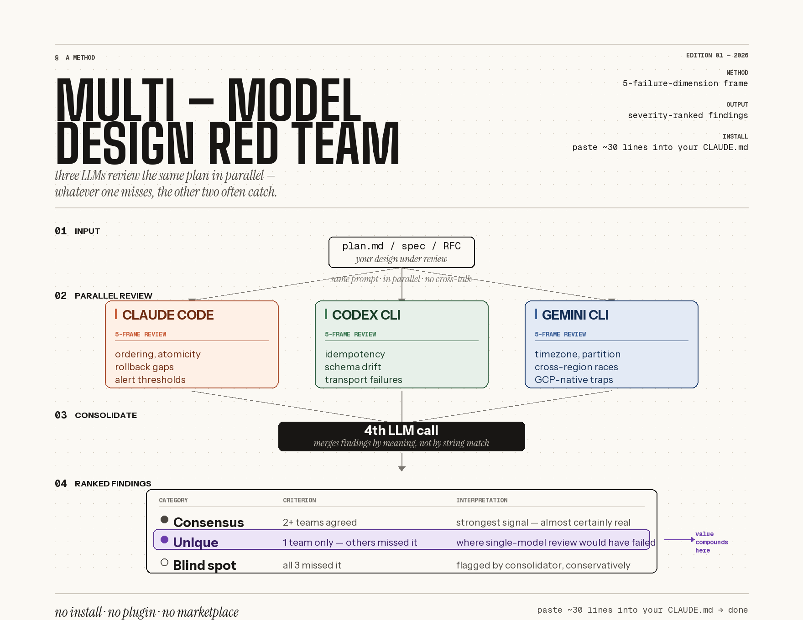

# The 5-failure-dimension methodology

When you ask an LLM to "review this design," what you usually get
back is abstract advice — "consider edge cases," "add monitoring,"
"watch for race conditions." Each item is technically true and
almost completely useless. There's nothing to act on, no metric to
alert against, no specific scenario to test.

The 5-failure-dimension frame is what we use instead. It demands
that every review cover all five dimensions below, with at least 2
concrete failure scenarios in each, and that each scenario specify
a TRIGGER, an IMPACT, and a DETECTABILITY window. That structure
forces findings to be actionable: each one can be written up as a
Jira ticket without further interpretation.

## The 5 dimensions, one sentence each

1. **Hidden assumptions** — what does this design rely on that
   isn't written down (ordering, uniqueness, atomicity, data
   freshness, caller behavior)?
2. **Dependency failures** — what happens when an upstream or
   downstream component *degrades*, not just goes down?
3. **Boundary inputs** — empty, huge, malformed, malicious; what
   does the design do at p99 and at malicious-percentile inputs?
4. **Misuse paths** — what happens if humans (callers, users,
   operators) don't follow the plan?
5. **Rollback & blast radius** — how do you recover when something
   goes wrong, and how big is the damage if it does?

## Why these 5

Most existing review frames either focus too narrowly (OWASP — only
security) or only fire after deploy (SRE Four Golden Signals —
operational health). The 5-dimension frame is built for the
pre-deploy moment: the design is written, the code isn't shipped
yet, and you want to know what's about to bite you.

We landed on 5 by collapsing earlier versions that had 7 (compliance
and observability ended up co-occurring with the existing 5 in
practice, so they got merged in). If your domain genuinely needs
more dimensions — regulated industries with explicit compliance
requirements, for instance — fork the prompt. It's CC0 specifically
for that.

## Where to go from here

- **The walkthrough** — [Chapter 02](../02-the-five-frame/) is the
  hands-on chapter that shows the frame applied. Start there if
  you're new.
- **The full essay** —
  [`02-the-five-frame/frame.md`](../02-the-five-frame/frame.md) has
  the deeper version, including a calibration rubric and concrete
  examples of good vs bad findings.
- **The prompt itself** —
  [`prompts/system-prompt.md`](../prompts/system-prompt.md) is the
  artifact (CC0 — copy it anywhere you want).
- **Why three models, not two?** — see
  [`why-three-not-two.md`](./why-three-not-two.md) for the
  reasoning behind the model count.

[← Back to README](../README.md)
